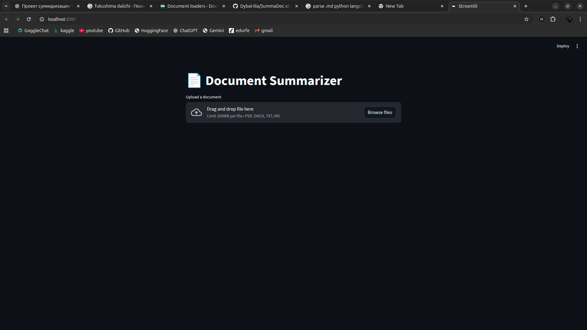

# SummaDoc

SummaDoc is an intellectual document summarizer with **Ollama** implementation. Here are provided key features and instructions on how to use it:

## 1. Installation
For some purposes uv is used, to install it open **Terminal** and insert:\
```curl -LsSf https://astral.sh/uv/install.sh | sh```

Clone the repository to your project:\
```git clone https://github.com/Dybal-Ilia/SummaDoc.git```

Donwload dependencies via terminal:\
```uv sync```

## 2. Usage

To run local server open **Terminal** and write:\
```uvicorn src.app.backend.main:app --reload```

Open another **Terminal** and write:\
```streamlit run src/app/frontend/ui.py```\
Choose any of provided links

You will see this:


Click **Browse files** and select a file to be summarized. Once selected you'll see a spinner telling you that summarization is in progress. After summarization is over you will see your summarized text.

## 3. Key Features
1. `Ingestor` class is presented as a factory using a correct loader base on the file extension.
2. `Splitter` class is realized via `RecursiveCharachterTextSplitter` from *langchain* which makes splitting logics more robust. 
3. `Summarizer` class under the hood is **OllamaChat** using **llama3.1:8b** model. Summarization partly follows *MapReduce* principle which is that chunks are summarized sepparately, though the LLM is allowed to monitor summarized chunks so far.
